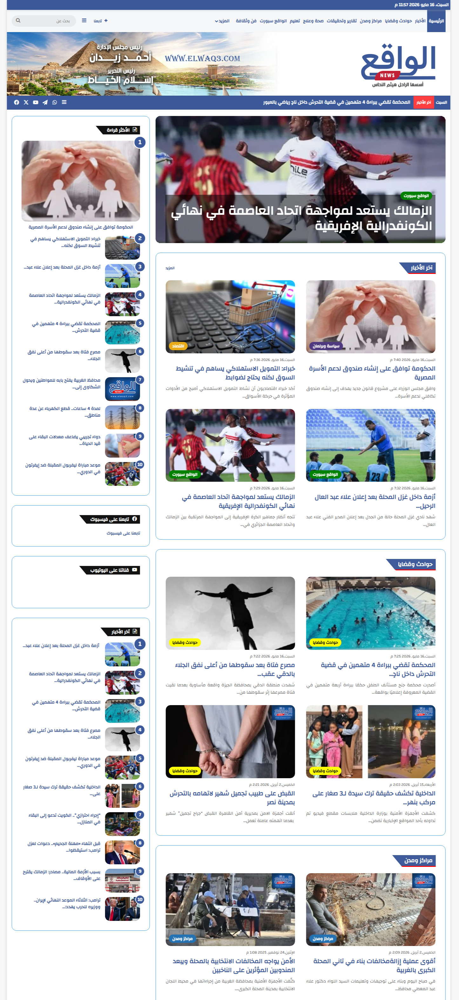
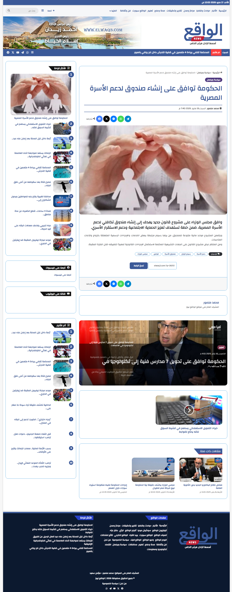
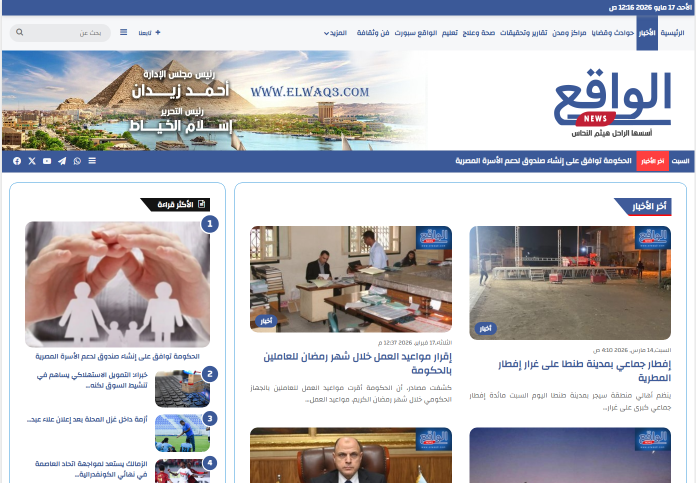
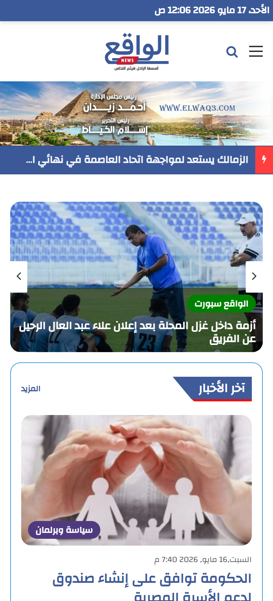
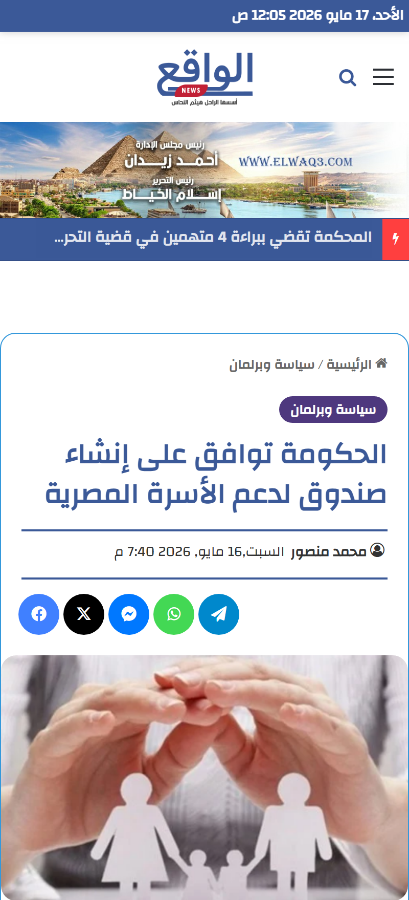
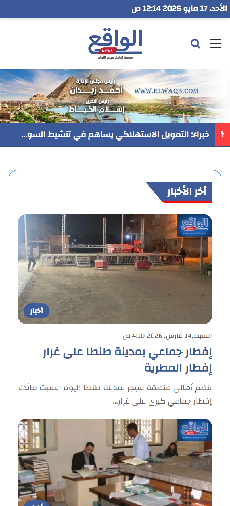

---

# Elwaq3 News

Production Case Study

Large-scale Arabic news platform built for high-traffic audiences with full RTL support, SEO optimization, and monetization integration.

---

## 📑 Table of Contents

- [🚀 Project Overview](#-project-overview)
- [✨ Key Features](#-key-features)
- [📰 Platform Structure & Pages](#-platform-structure--pages)
- [🧳 Technologies](#-technologies)
- [📸 Screenshots](#-screenshots)
- [🌍 Live Website](#-live-website)
- [📌 Project Information](#-project-information)
- [📈 Project Impact](#-project-impact)
- [🔒 Source Code](#-source-code)
- [📬 Contact Information](#-contact-information)

---

## 🚀 Project Overview

Elwaq3 News is a production-grade Arabic digital publishing platform developed using WordPress and tailored specifically for Arabic-speaking audiences.

The platform was designed to deliver scalable news publishing workflows, fast content delivery, SEO-friendly architecture, and responsive user experiences across desktop, tablet, and mobile devices.

The project focuses on performance, editorial efficiency, content discoverability, and audience engagement while maintaining a fully RTL-compatible architecture.

---

## ✨ Key Features

- Fully responsive RTL layout optimized for Arabic content
- Dynamic editorial structure with categorized publishing system
- Breaking news ticker and featured content sections
- SEO-optimized architecture using Yoast SEO & Google Search Console
- Google AdSense monetization integration
- Push notifications integration using Webpushr
- Multimedia article support (images, videos, embeds)
- Embedded live streaming support
- Role-based CMS permissions (Admin, Editor, Author, Subscriber)
- Performance optimization using lazy loading and CDN integration
- Secure WordPress setup with HTTPS, HSTS, and anti-spam protection
- Optimized mobile-first reading experience
- Search-friendly article structure and metadata handling

---

## 📰 Platform Structure & Pages

### Main Pages

- Home
- News
- Accidents & Cases
- Centers & Cities
- Reports & Investigations
- Health & Treatment
- Education
- Alwaq3 Sport
- Art & Culture

### Extended Pages

- Governorates
- Social Media
- Economy
- Politics & Parliament
- Technology & Information
- Alwaq3 Live
- Reality TV
- Reality Radio
- Opinion
- Readers’ Mail
- International Affairs
- Exam Results
- Obituaries Register
- Alwaq3 Album
- Alwaq3 Celebrations
- Sufism of Reality

---

## 🧳 Technologies

- WordPress
- HTML5
- CSS3
- JavaScript
- Yoast SEO
- Google Search Console
- Google AdSense
- Webpushr

---

## 📸 Screenshots

#### Homepage

#### Article Pages

#### Categories Page

### Mobile Responsive Views

#### Homepage

#### Article Pages

#### Categories Page

---

## 🌍 Live Website

https://elwaq3.com

👉 View full case study on my website:  
https://mahmoudabuyoussef.com/projects/elwaq3-news

---

## 📌 Project Information

| Field        | Details                    |
| ------------ | -------------------------- |
| Project Type | News Platform              |
| Industry     | Media & Digital Publishing |
| Role         | WordPress Developer        |
| Duration     | 2 Months                   |
| Status       | Live Production            |
| Year         | 2023                       |

---

## 📈 Project Impact

- Reached 20,000+ monthly active users
- Improved Google search visibility and indexing performance
- Increased audience engagement through push notifications
- Built scalable editorial publishing workflows
- Delivered stable responsive experience across all devices
- Improved page performance and content discoverability

---

## 🔒 Source Code

This project was developed for a real production environment.

The source code is private and not publicly available due to client and production restrictions.

This repository is intended for project presentation and case study purposes only.

---

## 📬 Contact Information

If you'd like to collaborate, discuss a project, or hire me for development work:

- 📧 Email: contact@mahmoudabuyoussef.com
- 💼 LinkedIn: https://www.linkedin.com/in/mahmoudabuyoussef
- 🌐 website: https://mahmoudabuyoussef.com
- 🐙 GitHub: https://github.com/mahmoud-abuyoussef
